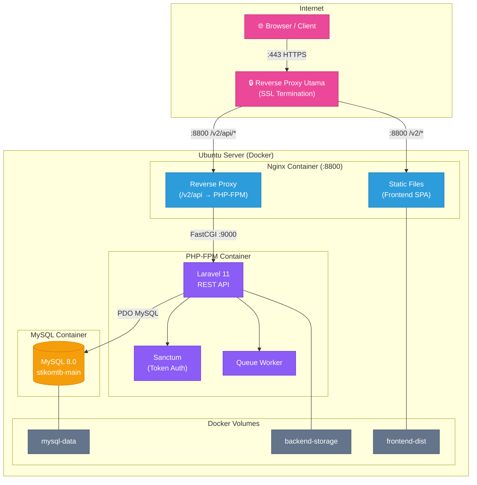
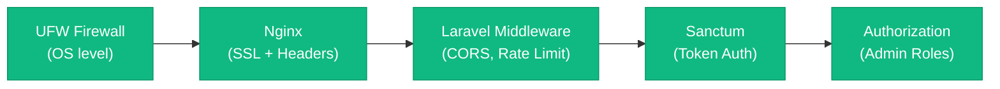

# 🏗️ Arsitektur Sistem

## Overview

Aplikasi STIKOM Tunas Bangsa menggunakan arsitektur **SPA + REST API** yang dicontainerisasi dengan Docker.

- **Frontend**: Single Page Application (React) — di-build menjadi file statis, disajikan langsung oleh Nginx
- **Backend**: REST API (Laravel) — berjalan di PHP-FPM, diproxy oleh Nginx
- **Database**: MySQL 8.0 — container terpisah dengan persistent volume

---

## Diagram Arsitektur



---

## Alur Request

### 1. Request Halaman Frontend (SPA)

```
Browser → Reverse Proxy Utama (:443 SSL)
       → Forward /v2/* ke Docker Nginx (:8800)
       → Serve static files dari /var/www/frontend/
       → index.html (React SPA bootstrap)
       → Browser download JS/CSS bundles (prefix /v2/assets/)
       → React Router (basename=/v2) menangani navigasi client-side
```

### 2. Request API (`/v2/api/*`)

```
Browser → Reverse Proxy Utama (:443 SSL)
       → Forward /v2/api/* ke Docker Nginx (:8800)
       → Strip /v2 prefix → /api/*
       → FastCGI proxy ke PHP-FPM (app:9000)
       → Laravel routing (routes/api.php)
       → Controller → Model → MySQL
       → JSON response kembali ke browser
```

### 3. Request Admin Panel (`/v2/admin-panel/*`)

```
Browser → Reverse Proxy Utama (:443 SSL)
       → Forward /v2/admin-panel/* ke Docker Nginx (:8800)
       → Serve SPA (index.html) ← sama seperti frontend
       → React Router → /v2/admin-panel/login
       → User login → POST /v2/api/admin/login
       → Sanctum token (Bearer) disimpan di memory
       → Semua API call admin menyertakan token di header
```

---

## Komponen Docker

| Service    | Image               | Port                  | Fungsi                                    |
| ---------- | ------------------- | --------------------- | ----------------------------------------- |
| `nginx`    | `nginx:1.27-alpine` | 8800 → 80             | Reverse proxy, serve SPA di subpath `/v2` |
| `app`      | Custom PHP 8.2 FPM  | 9000 (internal)       | Laravel API backend                       |
| `mysql`    | `mysql:8.0`         | 3306 (localhost only) | Database                                  |
| `frontend` | Custom Node 20      | —                     | Build SPA (one-shot, exit)                |

### Docker Volumes

| Volume            | Mount Point                | Fungsi                                    |
| ----------------- | -------------------------- | ----------------------------------------- |
| `mysql-data`      | `/var/lib/mysql`           | Persistent database storage               |
| `backend-storage` | `/var/www/backend/storage` | Upload files, logs Laravel                |
| `frontend-dist`   | `/var/www/frontend`        | Built SPA files (shared Nginx ↔ Frontend) |

### Docker Network

Semua container terhubung via bridge network `stikomtb-net`. Nginx di-expose ke host di port 8800. Reverse proxy utama server meneruskan `/v2` ke port ini. MySQL hanya bisa diakses dari container lain dalam network yang sama, dan port 3306 hanya di-bind ke `127.0.0.1`.

---

## Security Layers



1. **UFW Firewall** — Hanya port 22 (SSH), 80 (HTTP), 443 (HTTPS) yang terbuka
2. **Nginx** — SSL termination, security headers (HSTS, X-Frame-Options, dll)
3. **Laravel Middleware** — CORS (hanya domain sendiri), rate limiting (5 login/menit)
4. **Sanctum Token Auth** — Bearer token untuk admin API, expiry 12 jam
5. **Role-based Authorization** — `super_admin` untuk manage admins & hapus program

---

## Performance Optimizations

| Layer        | Optimization                                                               |
| ------------ | -------------------------------------------------------------------------- |
| **PHP**      | OPcache enabled, `validate_timestamps=0`, autoloader optimized             |
| **Laravel**  | Config/route/view caching di production                                    |
| **Nginx**    | Gzip compression, static asset caching (1 year), HTTP/2                    |
| **Frontend** | Code splitting (lazy routes), tree shaking (Vite), immutable asset hashing |
| **Database** | Indexed columns, connection pooling via PHP-FPM                            |
