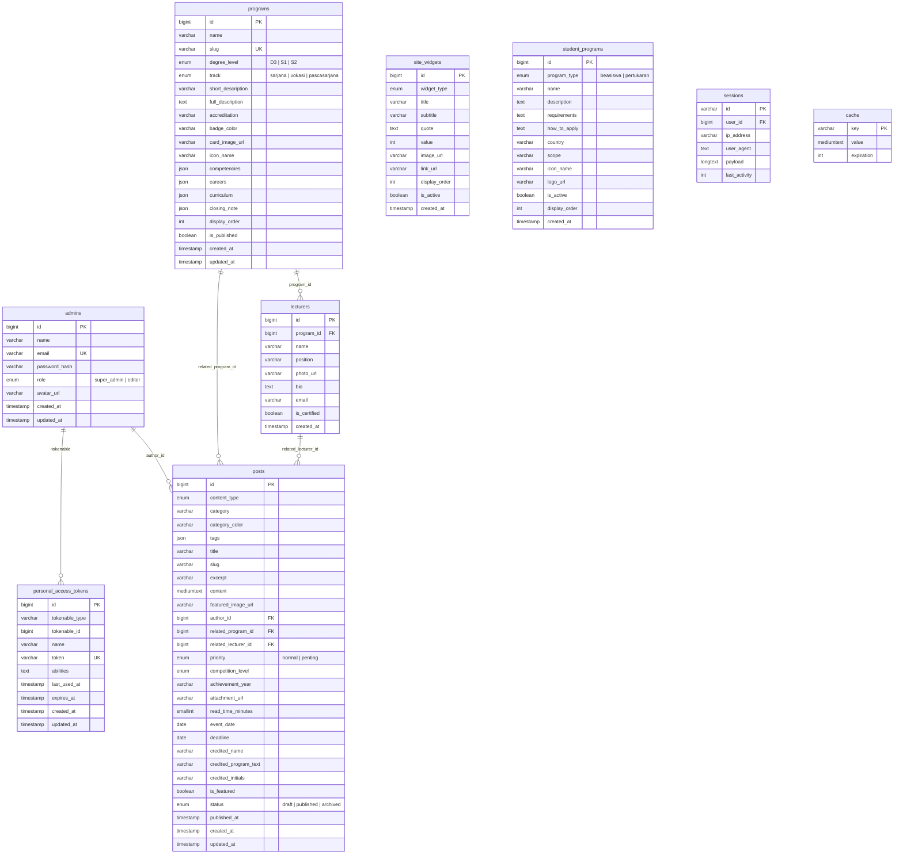

# 🗄️ Database

Dokumentasi skema database MySQL untuk STIKOM Tunas Bangsa.

**Database**: `stikomtb-main`  
**Engine**: MySQL 8.0  
**Charset**: `utf8mb4` / `utf8mb4_unicode_ci`

---

## Entity Relationship Diagram



---

## Tabel-Tabel

### 1. `admins`

Akun administrator CMS.

| Kolom | Tipe | Constraint | Keterangan |
|-------|------|-----------|------------|
| `id` | `BIGINT` | PK, AI | — |
| `name` | `VARCHAR(150)` | NOT NULL | Nama admin |
| `email` | `VARCHAR(150)` | UNIQUE, NOT NULL | Email login |
| `password_hash` | `VARCHAR(255)` | NOT NULL | Bcrypt hash (12 rounds) |
| `role` | `ENUM` | NOT NULL, default `editor` | `super_admin` atau `editor` |
| `avatar_url` | `VARCHAR(500)` | NULLABLE | URL foto profil |
| `created_at` | `TIMESTAMP` | — | — |
| `updated_at` | `TIMESTAMP` | — | — |

**Roles:**
- `super_admin` — Full access: kelola semua resource termasuk akun admin lain dan hapus program
- `editor` — Kelola konten: posts, programs (tanpa hapus), lecturers, widgets, student programs

---

### 2. `programs`

Program studi yang ditawarkan.

| Kolom | Tipe | Constraint | Keterangan |
|-------|------|-----------|------------|
| `id` | `BIGINT` | PK, AI | — |
| `name` | `VARCHAR(150)` | NOT NULL | Nama program (e.g. "Sistem Informasi") |
| `slug` | `VARCHAR(150)` | UNIQUE | URL-friendly name |
| `degree_level` | `ENUM('D3','S1','S2')` | NOT NULL | Jenjang pendidikan |
| `track` | `ENUM('sarjana','vokasi','pascasarjana')` | NOT NULL | Jalur studi |
| `short_description` | `VARCHAR(500)` | NOT NULL | Deskripsi singkat (untuk card) |
| `full_description` | `TEXT` | NULLABLE | Deskripsi lengkap (halaman detail) |
| `accreditation` | `VARCHAR(50)` | NULLABLE | Status akreditasi (e.g. "B", "Baik Sekali") |
| `badge_color` | `VARCHAR(20)` | default `blue` | Warna badge di UI |
| `card_image_url` | `VARCHAR(500)` | NULLABLE | Gambar card program |
| `icon_name` | `VARCHAR(50)` | NULLABLE | Nama icon Lucide |
| `competencies` | `JSON` | NULLABLE | Array kompetensi lulusan |
| `careers` | `JSON` | NULLABLE | Array prospek karir |
| `curriculum` | `JSON` | NULLABLE | Highlight kurikulum |
| `closing_note` | `JSON` | NULLABLE | Catatan penutup halaman detail |
| `display_order` | `INT` | default `0` | Urutan tampil |
| `is_published` | `BOOLEAN` | default `true` | Tampil di website publik |
| `created_at` | `TIMESTAMP` | — | — |
| `updated_at` | `TIMESTAMP` | — | — |

**Format JSON `competencies` / `careers`:**
```json
["Kemampuan A", "Kemampuan B", "Kemampuan C"]
```

---

### 3. `lecturers`

Data dosen.

| Kolom | Tipe | Constraint | Keterangan |
|-------|------|-----------|------------|
| `id` | `BIGINT` | PK, AI | — |
| `program_id` | `BIGINT` | FK → `programs.id`, NULLABLE | Program studi (null = belum ditentukan) |
| `name` | `VARCHAR(150)` | NOT NULL | Nama lengkap beserta gelar |
| `position` | `VARCHAR(150)` | NULLABLE | Jabatan (e.g. "Ketua Program Studi") |
| `photo_url` | `VARCHAR(500)` | NULLABLE | URL foto dosen |
| `bio` | `TEXT` | NULLABLE | Biografi singkat |
| `email` | `VARCHAR(150)` | NULLABLE | Email dosen |
| `is_certified` | `BOOLEAN` | default `false` | Bersertifikat pendidik |
| `created_at` | `TIMESTAMP` | default CURRENT | — |

**Index:** `idx_lecturers_program` pada `program_id`

**Relasi:**
- `program_id` → `programs.id` (ON DELETE SET NULL)

---

### 4. `posts`

Konten artikel, berita, pengumuman, dan kegiatan. Tabel paling kompleks — digunakan untuk 7 jenis konten yang berbeda.

| Kolom | Tipe | Constraint | Keterangan |
|-------|------|-----------|------------|
| `id` | `BIGINT` | PK, AI | — |
| `content_type` | `ENUM` | NOT NULL | Jenis konten (lihat di bawah) |
| `category` | `VARCHAR(80)` | NULLABLE | Kategori tambahan |
| `category_color` | `VARCHAR(20)` | default `blue` | Warna badge kategori |
| `tags` | `JSON` | NULLABLE | Array tag |
| `title` | `VARCHAR(250)` | NOT NULL | Judul post |
| `slug` | `VARCHAR(250)` | NOT NULL | URL-friendly title |
| `excerpt` | `VARCHAR(500)` | NULLABLE | Ringkasan |
| `content` | `MEDIUMTEXT` | NULLABLE | Isi HTML |
| `featured_image_url` | `VARCHAR(500)` | NULLABLE | Gambar utama |
| `author_id` | `BIGINT` | FK → `admins.id`, NULLABLE | Penulis |
| `related_program_id` | `BIGINT` | FK → `programs.id`, NULLABLE | Program terkait |
| `related_lecturer_id` | `BIGINT` | FK → `lecturers.id`, NULLABLE | Dosen terkait |
| `priority` | `ENUM('normal','penting')` | NULLABLE | Prioritas pengumuman |
| `competition_level` | `ENUM` | NULLABLE | Level kompetisi prestasi |
| `achievement_year` | `VARCHAR(4)` | NULLABLE | Tahun prestasi |
| `attachment_url` | `VARCHAR(500)` | NULLABLE | File lampiran |
| `read_time_minutes` | `SMALLINT UNSIGNED` | NULLABLE | Estimasi waktu baca |
| `event_date` | `DATE` | NULLABLE | Tanggal kegiatan |
| `deadline` | `DATE` | NULLABLE | Batas waktu pengumuman |
| `credited_name` | `VARCHAR(150)` | NULLABLE | Nama yang di-credit |
| `credited_program_text` | `VARCHAR(150)` | NULLABLE | Teks program studi |
| `credited_initials` | `VARCHAR(5)` | NULLABLE | Inisial (untuk avatar) |
| `is_featured` | `BOOLEAN` | default `false` | Tampil di homepage |
| `status` | `ENUM('draft','published','archived')` | default `draft` | Status publikasi |
| `published_at` | `TIMESTAMP` | NULLABLE | Waktu publikasi |
| `created_at` | `TIMESTAMP` | — | — |
| `updated_at` | `TIMESTAMP` | — | — |

**Content Types:**

| Nilai | Ditampilkan di | Keterangan |
|-------|---------------|------------|
| `berita` | `/informations` | Berita umum kampus |
| `pengumuman` | `/announcements` | Pengumuman resmi |
| `kegiatan_akademik` | `/academics/kegiatan-akademik` | Kegiatan akademik |
| `kegiatan_mahasiswa` | `/students/kegiatan-mahasiswa` | Kegiatan mahasiswa |
| `prestasi_kampus` | `/academics/prestasi-kampus` | Prestasi institusi |
| `prestasi_dosen` | `/academics/prestasi-dosen` | Prestasi dosen |
| `prestasi_mahasiswa` | `/students/prestasi-mahasiswa` | Prestasi mahasiswa |

**Index:**
- `uq_posts_type_slug` — UNIQUE pada `(content_type, slug)` → slug unik per tipe
- `idx_posts_listing` — `(content_type, status, published_at)` → query listing
- `idx_posts_featured` — `(is_featured)` → homepage query
- `idx_posts_program` — `(related_program_id)` → filter per program
- `idx_posts_updated_at` — `(updated_at)` → admin sort

**Relasi:**
- `author_id` → `admins.id` (ON DELETE SET NULL)
- `related_program_id` → `programs.id` (ON DELETE SET NULL)
- `related_lecturer_id` → `lecturers.id` (ON DELETE SET NULL)

---

### 5. `site_widgets`

Konten widget untuk homepage dan halaman lain (statistik, testimoni, mitra, galeri).

| Kolom | Tipe | Constraint | Keterangan |
|-------|------|-----------|------------|
| `id` | `BIGINT` | PK, AI | — |
| `widget_type` | `ENUM` | NOT NULL | Tipe widget |
| `title` | `VARCHAR(200)` | NULLABLE | Judul/label |
| `subtitle` | `VARCHAR(200)` | NULLABLE | Subjudul |
| `quote` | `TEXT` | NULLABLE | Kutipan (untuk testimoni) |
| `value` | `INT` | NULLABLE | Nilai numerik (untuk statistik) |
| `image_url` | `VARCHAR(500)` | NULLABLE | URL gambar |
| `link_url` | `VARCHAR(500)` | NULLABLE | URL tautan |
| `display_order` | `INT` | default `0` | Urutan tampil |
| `is_active` | `BOOLEAN` | default `true` | Aktif/nonaktif |
| `created_at` | `TIMESTAMP` | default CURRENT | — |

**Widget Types:**
| Tipe | Contoh Penggunaan |
|------|-------------------|
| `testimonial` | Testimoni mahasiswa/alumni di homepage |
| `partner` | Logo mitra kerja sama |
| `gallery_image` | Galeri foto kampus |
| `campus_stat` | Statistik (mahasiswa, dosen, akreditasi, dll) |

**Index:** `idx_widgets_type` pada `(widget_type, is_active, display_order)`

---

### 6. `student_programs`

Program mahasiswa (beasiswa & pertukaran pelajar).

| Kolom | Tipe | Constraint | Keterangan |
|-------|------|-----------|------------|
| `id` | `BIGINT` | PK, AI | — |
| `program_type` | `ENUM('beasiswa','pertukaran')` | NOT NULL | Jenis program |
| `name` | `VARCHAR(200)` | NOT NULL | Nama program |
| `description` | `TEXT` | NULLABLE | Deskripsi program |
| `requirements` | `TEXT` | NULLABLE | Persyaratan |
| `how_to_apply` | `TEXT` | NULLABLE | Cara mendaftar |
| `country` | `VARCHAR(100)` | NULLABLE | Negara tujuan (pertukaran) |
| `scope` | `VARCHAR(50)` | NULLABLE | Cakupan (nasional/internasional) |
| `icon_name` | `VARCHAR(50)` | NULLABLE | Nama icon Lucide |
| `logo_url` | `VARCHAR(500)` | NULLABLE | Logo program |
| `is_active` | `BOOLEAN` | default `true` | Status aktif |
| `display_order` | `INT` | default `0` | Urutan tampil |
| `created_at` | `TIMESTAMP` | default CURRENT | — |

**Index:** `idx_student_programs_type` pada `(program_type, is_active, display_order)`

---

### 7. `personal_access_tokens`

Tabel Sanctum untuk menyimpan API token admin.

| Kolom | Tipe | Constraint | Keterangan |
|-------|------|-----------|------------|
| `id` | `BIGINT` | PK, AI | — |
| `tokenable_type` | `VARCHAR(255)` | NOT NULL | Model class (selalu `App\Models\Admin`) |
| `tokenable_id` | `BIGINT` | NOT NULL | `admins.id` |
| `name` | `VARCHAR(255)` | NOT NULL | Nama token |
| `token` | `VARCHAR(64)` | UNIQUE | SHA-256 hash token |
| `abilities` | `TEXT` | NULLABLE | JSON array abilities |
| `last_used_at` | `TIMESTAMP` | NULLABLE | Terakhir dipakai |
| `expires_at` | `TIMESTAMP` | NULLABLE | Masa berlaku |
| `created_at` | `TIMESTAMP` | — | — |
| `updated_at` | `TIMESTAMP` | — | — |

**Index:** `(tokenable_type, tokenable_id)` — Polymorphic lookup

---

### 8. `sessions`

Session storage (driver: database).

### 9. `cache` + `cache_locks`

Cache storage (driver: database).

---

## Catatan Desain

### Penggunaan ENUM

Database ini cukup banyak menggunakan MySQL `ENUM` untuk kolom-kolom dengan nilai terbatas:
- `admins.role`: `super_admin`, `editor`
- `programs.degree_level`: `D3`, `S1`, `S2`
- `posts.content_type`: 7 jenis konten
- `posts.status`: `draft`, `published`, `archived`
- `site_widgets.widget_type`: 4 tipe widget
- `student_programs.program_type`: `beasiswa`, `pertukaran`

> ⚠️ Menambah/mengubah nilai ENUM di MySQL memerlukan `ALTER TABLE`. Pertimbangkan migrasi terlebih dahulu.

### Tabel `posts` Sebagai Tabel Generik

Tabel `posts` sengaja dirancang sebagai **tabel generik** untuk semua jenis konten (berita, pengumuman, kegiatan, prestasi). Ini menghindari membuat 7 tabel terpisah yang strukturnya hampir identik. Kolom-kolom spesifik (seperti `competition_level` untuk prestasi, `deadline` untuk pengumuman) dibiarkan NULLABLE dan hanya diisi sesuai `content_type`.

### JSON Columns

Kolom JSON digunakan untuk data yang:
- Berupa list/array sederhana (`tags`, `competencies`, `careers`)
- Tidak perlu di-query secara individual
- Fleksibel dalam jumlah item

### Soft Delete

Proyek ini **tidak menggunakan soft delete**. Data yang dihapus benar-benar dihapus dari database. Backup database harus dilakukan secara rutin sebagai proteksi.
