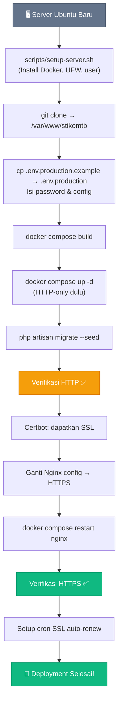

# 🚀 Panduan Deployment

Panduan lengkap deploy aplikasi STIKOM Tunas Bangsa ke server Ubuntu menggunakan Docker.

---

## Persyaratan Server

| Komponen | Minimum | Rekomendasi |
|----------|---------|-------------|
| **OS** | Ubuntu 20.04 LTS | Ubuntu 22.04 LTS |
| **RAM** | 2 GB | 4 GB |
| **Disk** | 20 GB | 40 GB SSD |
| **CPU** | 1 vCPU | 2 vCPU |
| **Network** | Port 22, 80, 443 terbuka | — |

Pastikan domain `stikomtunasbangsa.ac.id` sudah mengarah ke IP server.

---

## Langkah 1: Setup Server (Pertama Kali)

### 1.1 Login ke Server

```bash
ssh root@<IP_SERVER>
```

### 1.2 Jalankan Setup Script

Script ini menginstall Docker, konfigurasi firewall, dan membuat user deploy.

```bash
# Download atau clone repository dulu
git clone <REPO_URL> /tmp/stikomtb

# Jalankan setup
bash /tmp/stikomtb/scripts/setup-server.sh
```

Script akan melakukan:
- ✅ Update sistem & install dependensi
- ✅ Install Docker Engine + Docker Compose plugin
- ✅ Konfigurasi firewall (UFW): SSH, HTTP, HTTPS
- ✅ Buat user `deploy` dengan akses Docker
- ✅ Buat direktori `/var/www/stikomtb`
- ✅ Setup Docker log rotation

### 1.3 Setup SSH Key untuk User Deploy

```bash
# Di server (sebagai root)
su - deploy
mkdir -p ~/.ssh
nano ~/.ssh/authorized_keys
# Paste public key Anda
chmod 600 ~/.ssh/authorized_keys
chmod 700 ~/.ssh
```

---

## Langkah 2: Clone & Konfigurasi

### 2.1 Clone Repository

```bash
su - deploy
cd /var/www/stikomtb
git clone <REPO_URL> .
```

### 2.2 Konfigurasi Environment

```bash
cp .env.production.example .env.production
nano .env.production
```

**Variabel yang WAJIB diubah:**

| Variabel | Contoh Nilai | Keterangan |
|----------|-------------|------------|
| `APP_KEY` | *(generate nanti)* | Akan di-generate otomatis |
| `DB_PASSWORD` | `p@ssw0rd_kuat_123` | Password MySQL user |
| `DB_ROOT_PASSWORD` | `r00t_kuat_456` | Password MySQL root |
| `MAIL_HOST` | `smtp.gmail.com` | SMTP server (opsional) |
| `MAIL_USERNAME` | `user@gmail.com` | SMTP username (opsional) |
| `MAIL_PASSWORD` | `app_password` | SMTP password (opsional) |

> ⚠️ **PENTING**: Gunakan password yang kuat! Jangan gunakan password default.

---

## Langkah 3: Deploy Pertama Kali

### 3.1 Build & Start (tanpa SSL dulu)

Pertama kali deploy, kita harus start tanpa SSL karena Certbot perlu Nginx running untuk verifikasi domain.

```bash
# Gunakan config HTTP-only dulu
cp docker/nginx/default-http-only.conf docker/nginx/default.conf

# Build dan start
docker compose build --parallel
docker compose up -d

# Tunggu MySQL siap (30 detik)
sleep 30

# Generate APP_KEY
APP_KEY=$(docker compose exec -T app php artisan key:generate --show)
echo "APP_KEY yang di-generate: $APP_KEY"

# Update .env.production dengan APP_KEY di atas
nano .env.production

# Restart app agar membaca key baru
docker compose restart app

# Jalankan migration & seeder
docker compose exec -T app php artisan migrate --seed --force

# Optimize Laravel
docker compose exec -T app php artisan config:cache
docker compose exec -T app php artisan route:cache
docker compose exec -T app php artisan view:cache
docker compose exec -T app php artisan storage:link
```

### 3.2 Verifikasi HTTP

Buka `http://stikomtunasbangsa.ac.id` di browser — harus bisa muncul tampilan website.

### 3.3 Setup SSL (Let's Encrypt)

```bash
# Dapatkan sertifikat SSL
docker compose run --rm certbot certonly \
    --webroot \
    -w /var/www/certbot \
    -d stikomtunasbangsa.ac.id \
    -d www.stikomtunasbangsa.ac.id \
    --email admin@stikomtunasbangsa.ac.id \
    --agree-tos \
    --no-eff-email
```

Jika berhasil, output akan menunjukkan path sertifikat:
```
Certificate is saved at: /etc/letsencrypt/live/stikomtunasbangsa.ac.id/fullchain.pem
Key is saved at:         /etc/letsencrypt/live/stikomtunasbangsa.ac.id/privkey.pem
```

### 3.4 Aktifkan HTTPS

```bash
# Backup config HTTP-only
cp docker/nginx/default.conf docker/nginx/default-http-only.conf.bak

# Copy config HTTPS (yang asli dari repo)
git checkout docker/nginx/default.conf

# Restart Nginx
docker compose restart nginx
```

### 3.5 Verifikasi HTTPS

Buka `https://stikomtunasbangsa.ac.id` — harus redirect dari HTTP ke HTTPS dengan gembok hijau.

### 3.6 Setup Auto-Renew SSL

Sertifikat Let's Encrypt berlaku 90 hari. Setup cron untuk auto-renew:

```bash
# Edit crontab
crontab -e

# Tambahkan baris ini (renew setiap Minggu jam 03:00):
0 3 * * 0 cd /var/www/stikomtb && docker compose run --rm certbot renew && docker compose exec nginx nginx -s reload >> /var/log/certbot-renew.log 2>&1
```

---

## Langkah 4: Deploy Update

Untuk update aplikasi setelah ada perubahan kode:

### Cara Cepat (menggunakan script)

```bash
cd /var/www/stikomtb
bash scripts/deploy.sh
```

### Cara Manual

```bash
cd /var/www/stikomtb

# Pull kode terbaru
git pull origin main

# Rebuild images
docker compose build --parallel

# Restart containers
docker compose up -d

# Jalankan migration (jika ada)
docker compose exec -T app php artisan migrate --force

# Clear & rebuild cache
docker compose exec -T app php artisan config:cache
docker compose exec -T app php artisan route:cache
docker compose exec -T app php artisan view:cache
```

### Deploy dengan Opsi

```bash
# Deploy tanpa rebuild (cepat, jika hanya update .env)
bash scripts/deploy.sh --skip-build

# Deploy dengan reset database (HATI-HATI: hapus semua data!)
bash scripts/deploy.sh --fresh-db

# Deploy dengan perpanjang SSL
bash scripts/deploy.sh --ssl-renew
```

---

## Monitoring & Maintenance

### Melihat Log

```bash
# Log semua service
docker compose logs -f

# Log spesifik service
docker compose logs -f app       # Backend PHP
docker compose logs -f nginx     # Nginx access/error
docker compose logs -f mysql     # MySQL

# Log terakhir 100 baris
docker compose logs --tail 100 app
```

### Status Container

```bash
docker compose ps
```

### Restart Service

```bash
# Restart satu service
docker compose restart app
docker compose restart nginx

# Restart semua
docker compose restart

# Stop semua
docker compose down

# Stop & hapus volume (HATI-HATI: data hilang!)
docker compose down -v
```

### Masuk ke Container

```bash
# Shell ke PHP container
docker compose exec app sh

# Laravel Tinker (REPL)
docker compose exec app php artisan tinker

# MySQL CLI
docker compose exec mysql mysql -u stikomtb -p stikomtb-main
```

### Backup Database

```bash
# Backup
docker compose exec mysql mysqldump -u root -p stikomtb-main > backup_$(date +%Y%m%d).sql

# Restore
docker compose exec -T mysql mysql -u root -p stikomtb-main < backup_20260901.sql
```

### Disk Usage

```bash
# Cek penggunaan disk Docker
docker system df

# Bersihkan resources yang tidak terpakai
docker system prune -f

# Bersihkan images yang tidak terpakai
docker image prune -f
```

---

## Troubleshooting

### ❌ Container app terus restart

```bash
# Cek log error
docker compose logs app

# Biasanya:
# - .env.production belum benar (APP_KEY kosong)
# - MySQL belum siap (tunggu healthcheck)
# - Permission issue di storage/
docker compose exec app chmod -R 775 storage bootstrap/cache
```

### ❌ 502 Bad Gateway di Nginx

```bash
# Cek apakah PHP-FPM berjalan
docker compose ps app

# Cek Nginx error log
docker compose logs nginx

# Biasanya: PHP-FPM belum start atau crash
docker compose restart app
```

### ❌ CORS Error di browser

Pastikan `FRONTEND_URL` di `.env.production` sesuai dengan domain yang diakses:
```
FRONTEND_URL=https://stikomtunasbangsa.ac.id
```

### ❌ SSL Certificate gagal

```bash
# Pastikan domain sudah mengarah ke IP server
dig stikomtunasbangsa.ac.id

# Pastikan port 80 bisa diakses (untuk ACME challenge)
curl http://stikomtunasbangsa.ac.id/.well-known/acme-challenge/test

# Cek log Certbot
docker compose logs certbot
```

### ❌ Permission denied pada storage

```bash
docker compose exec app chown -R appuser:appgroup storage bootstrap/cache
docker compose exec app chmod -R 775 storage bootstrap/cache
```

### ❌ MySQL connection refused

```bash
# Cek apakah MySQL sudah healthy
docker compose ps mysql

# Cek dengan detail
docker inspect stikomtb-mysql | grep -A 10 Health

# Pastikan DB_HOST=mysql (bukan localhost atau 127.0.0.1)
```

---

## Diagram Deployment Flow


