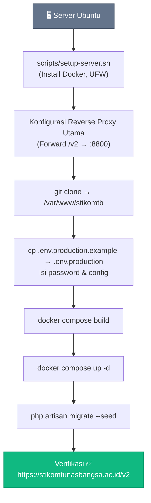

# 🚀 Panduan Deployment

Panduan lengkap deploy aplikasi STIKOM Tunas Bangsa ke server Ubuntu menggunakan Docker.

> **Catatan**: Aplikasi ini di-deploy di subpath `/v2` (`https://stikomtunasbangsa.ac.id/v2`).
> SSL/HTTPS ditangani oleh reverse proxy utama server. Docker Nginx hanya listen di port `8800` (HTTP).

---

## Arsitektur Deployment

```
Internet → Reverse Proxy Utama (SSL, :443)
         → /v2/* → Docker Nginx (:8800)
                  → /v2/api/* → PHP-FPM (Laravel)
                  → /v2/*     → Frontend SPA (React)
                  → MySQL (internal)
```

---

## Persyaratan Server

| Komponen | Minimum | Rekomendasi |
|----------|---------|-------------|
| **OS** | Ubuntu 20.04 LTS | Ubuntu 22.04 LTS |
| **RAM** | 2 GB | 4 GB |
| **Disk** | 20 GB | 40 GB SSD |
| **CPU** | 1 vCPU | 2 vCPU |
| **Network** | Port 22, 8800 terbuka | — |

**Prasyarat:**
- Reverse proxy utama (Nginx/Apache/Caddy) sudah dikonfigurasi di server untuk menangani SSL dan meneruskan `/v2` ke `localhost:8800`
- Domain `stikomtunasbangsa.ac.id` sudah mengarah ke IP server

---

## Langkah 1: Setup Server (Pertama Kali)

### 1.1 Login ke Server

```bash
ssh root@<IP_SERVER>
```

### 1.2 Jalankan Setup Script

```bash
git clone <REPO_URL> /tmp/stikomtb
bash /tmp/stikomtb/scripts/setup-server.sh
```

Script akan melakukan:
- ✅ Update sistem & install dependensi
- ✅ Install Docker Engine + Docker Compose plugin
- ✅ Konfigurasi firewall (UFW)
- ✅ Buat user `deploy` dengan akses Docker
- ✅ Buat direktori `/var/www/stikomtb`
- ✅ Setup Docker log rotation

### 1.3 Konfigurasi Reverse Proxy Utama

Tambahkan konfigurasi di reverse proxy utama server untuk meneruskan `/v2` ke Docker Nginx:

**Contoh Nginx (reverse proxy utama):**
```nginx
location /v2 {
    proxy_pass http://127.0.0.1:8800;
    proxy_set_header Host $host;
    proxy_set_header X-Real-IP $remote_addr;
    proxy_set_header X-Forwarded-For $proxy_add_x_forwarded_for;
    proxy_set_header X-Forwarded-Proto $scheme;
    proxy_buffering off;
    client_max_body_size 12M;
}
```

**Contoh Apache:**
```apache
ProxyPass /v2 http://127.0.0.1:8800/v2
ProxyPassReverse /v2 http://127.0.0.1:8800/v2
```

---

## Langkah 2: Clone & Konfigurasi

### 2.1 Clone Repository

```bash
su - deploy
cd /var/www/stikomtb
git clone <REPO_URL> .
```

### 2.2 Konfigurasi Environment

```bash
cp .env.production.example .env.production
nano .env.production
```

**Variabel yang WAJIB diubah:**

| Variabel | Contoh Nilai | Keterangan |
|----------|-------------|------------|
| `APP_KEY` | *(generate nanti)* | Akan di-generate otomatis |
| `DB_PASSWORD` | `p@ssw0rd_kuat_123` | Password MySQL user |
| `DB_ROOT_PASSWORD` | `r00t_kuat_456` | Password MySQL root |
| `MAIL_HOST` | `smtp.gmail.com` | SMTP server (opsional) |

> ⚠️ **PENTING**: Gunakan password yang kuat! Jangan gunakan password default.

---

## Langkah 3: Deploy Pertama Kali

### 3.1 Build & Start

```bash
# Build dan start semua containers
docker compose build --parallel
docker compose up -d

# Tunggu MySQL siap (30 detik)
sleep 30

# Generate APP_KEY
APP_KEY=$(docker compose exec -T app php artisan key:generate --show)
echo "APP_KEY yang di-generate: $APP_KEY"

# Update .env.production dengan APP_KEY di atas
nano .env.production

# Restart app agar membaca key baru
docker compose restart app

# Jalankan migration & seeder
docker compose exec -T app php artisan migrate --seed --force

# Optimize Laravel
docker compose exec -T app php artisan config:cache
docker compose exec -T app php artisan route:cache
docker compose exec -T app php artisan view:cache
docker compose exec -T app php artisan storage:link
```

### 3.2 Verifikasi

```bash
# Cek semua container running
docker compose ps

# Test langsung ke Docker Nginx
curl -I http://localhost:8800/v2

# Test melalui domain (setelah reverse proxy dikonfigurasi)
curl -I https://stikomtunasbangsa.ac.id/v2
```

---

## Langkah 4: Deploy Update

Untuk update aplikasi setelah ada perubahan kode:

### Cara Cepat (menggunakan script)

```bash
cd /var/www/stikomtb
bash scripts/deploy.sh
```

### Cara Manual

```bash
cd /var/www/stikomtb

# Pull kode terbaru
git pull origin main

# Rebuild images
docker compose build --parallel

# Restart containers
docker compose up -d

# Jalankan migration (jika ada)
docker compose exec -T app php artisan migrate --force

# Clear & rebuild cache
docker compose exec -T app php artisan config:cache
docker compose exec -T app php artisan route:cache
docker compose exec -T app php artisan view:cache
```

### Deploy dengan Opsi

```bash
# Deploy tanpa rebuild (cepat, jika hanya update .env)
bash scripts/deploy.sh --skip-build

# Deploy dengan reset database (HATI-HATI: hapus semua data!)
bash scripts/deploy.sh --fresh-db
```

---

## Monitoring & Maintenance

### Melihat Log

```bash
# Log semua service
docker compose logs -f

# Log spesifik service
docker compose logs -f app       # Backend PHP
docker compose logs -f nginx     # Nginx access/error
docker compose logs -f mysql     # MySQL

# Log terakhir 100 baris
docker compose logs --tail 100 app
```

### Status Container

```bash
docker compose ps
```

### Restart Service

```bash
# Restart satu service
docker compose restart app
docker compose restart nginx

# Restart semua
docker compose restart

# Stop semua
docker compose down

# Stop & hapus volume (HATI-HATI: data hilang!)
docker compose down -v
```

### Masuk ke Container

```bash
# Shell ke PHP container
docker compose exec app sh

# Laravel Tinker (REPL)
docker compose exec app php artisan tinker

# MySQL CLI
docker compose exec mysql mysql -u stikomtb -p stikomtb-main
```

### Backup Database

```bash
# Backup
docker compose exec mysql mysqldump -u root -p stikomtb-main > backup_$(date +%Y%m%d).sql

# Restore
docker compose exec -T mysql mysql -u root -p stikomtb-main < backup_20260901.sql
```

### Disk Usage

```bash
# Cek penggunaan disk Docker
docker system df

# Bersihkan resources yang tidak terpakai
docker system prune -f
```

---

## Troubleshooting

### ❌ Container app terus restart

```bash
docker compose logs app
# Biasanya: APP_KEY kosong, MySQL belum siap, atau permission issue
docker compose exec app chmod -R 775 storage bootstrap/cache
```

### ❌ 502 Bad Gateway

```bash
docker compose ps app
docker compose logs nginx
# Biasanya: PHP-FPM belum start
docker compose restart app
```

### ❌ CORS Error di browser

Pastikan `FRONTEND_URL` di `.env.production` sesuai:
```
FRONTEND_URL=https://stikomtunasbangsa.ac.id/v2
```

### ❌ Halaman tidak ditemukan (404) di subpath /v2

```bash
# Pastikan Vite build menggunakan base '/v2/'
docker compose exec app env | grep VITE

# Rebuild frontend
docker compose build frontend
docker compose up -d frontend
docker compose restart nginx
```

### ❌ API calls gagal (404 atau wrong path)

Pastikan request API mengarah ke `/v2/api/...` (bukan `/api/...`):
```bash
curl http://localhost:8800/v2/api/programs
```

### ❌ MySQL connection refused

```bash
docker compose ps mysql
# Pastikan DB_HOST=mysql di .env.production (bukan localhost)
```

---

## Diagram Deployment Flow


